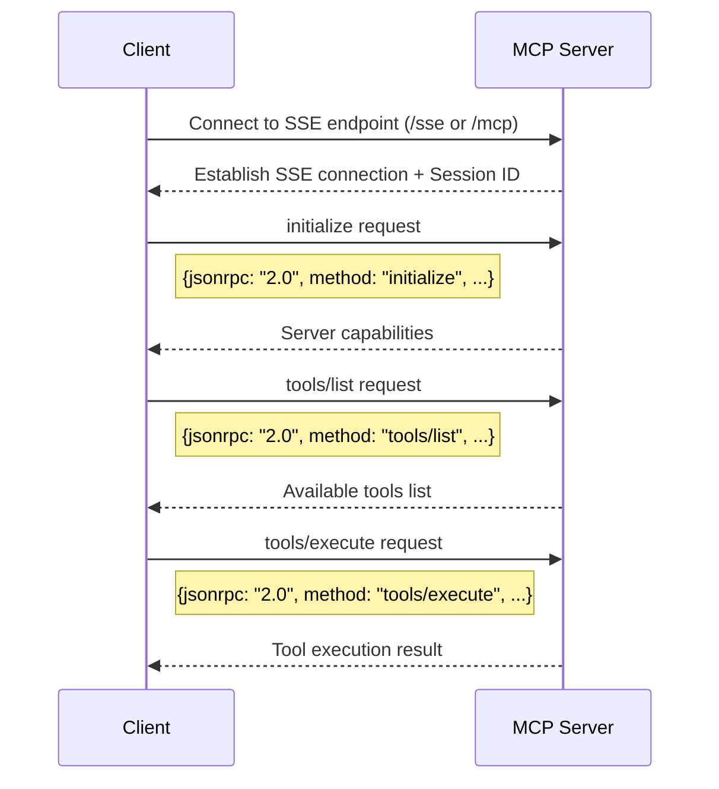

# MCP (Model Context Protocol) Communication Flow

## Overview

MCP (Model Context Protocol) is a standardized protocol for tool discovery and execution. At its core, it enables communication between clients and servers that provide tools/capabilities, independent of any LLM integration.

## Basic Communication Flow



## Key Components

1. **SSE (Server-Sent Events) Connection**
   - Long-lived connection between client and server
   - Enables server to push updates to client
   - Session management via session_id

2. **JSON-RPC Messages**
   - All requests follow JSON-RPC 2.0 format
   - Standard methods: initialize, tools/list, tools/execute
   - Structured request/response format

3. **Session Management**
   - Each client maintains a unique session
   - Session ID used for all subsequent requests
   - Enables stateful communication

## Standard Message Types

### 1. Initialize Request
```json
{
  "jsonrpc": "2.0",
  "method": "initialize",
  "params": {
    "protocolVersion": "1.0",
    "clientInfo": {
      "name": "Example Client",
      "version": "1.0.0"
    },
    "capabilities": {
      "tools": true
    }
  },
  "id": "init-1"
}
```

### 2. Tools List Request
```json
{
  "jsonrpc": "2.0",
  "method": "tools/list",
  "params": {},
  "id": "list-1"
}
```

### 3. Tool Execution Request
```json
{
  "jsonrpc": "2.0",
  "method": "tools/execute",
  "params": {
    "tool_id": "example_tool",
    "parameters": {
      "param1": "value1"
    }
  },
  "id": "exec-1"
}
```

## Implementation Examples

### Basic Client Connection
```python
async with sse_client(url="http://localhost:8000/sse") as (read, write):
    async with ClientSession(read, write) as session:
        # Initialize connection
        await session.initialize()
        
        # Get available tools
        tools = await session.list_tools()
        
        # Execute a tool
        result = await session.call_tool("tool_name", {"param": "value"})
```

## Key Points

1. **Protocol Independence**
   - MCP works independently of any LLM or AI model
   - Pure client-server communication protocol
   - Can be used with or without AI integration

2. **Standardization**
   - Consistent message format
   - Well-defined lifecycle
   - Predictable behavior

3. **Extensibility**
   - Supports custom tools
   - Flexible parameter schemas
   - Can be extended with additional capabilities

## Common Use Cases

1. **Tool Discovery**
   - Clients discovering available capabilities
   - Dynamic tool registration
   - Capability negotiation

2. **Remote Tool Execution**
   - Execute tools on remote servers
   - Handle long-running operations
   - Process results asynchronously

3. **Service Integration**
   - Connect to multiple tool providers
   - Aggregate capabilities
   - Standardized interface

## Best Practices

1. **Connection Management**
   - Maintain persistent SSE connections
   - Handle reconnection gracefully
   - Clean up resources properly

2. **Error Handling**
   - Handle network errors
   - Process timeout scenarios
   - Validate responses

3. **Session Handling**
   - Track session state
   - Include session ID in requests
   - Handle session expiration 
